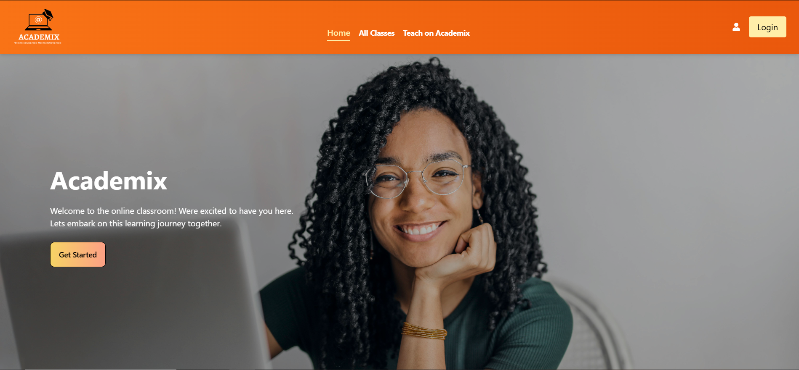
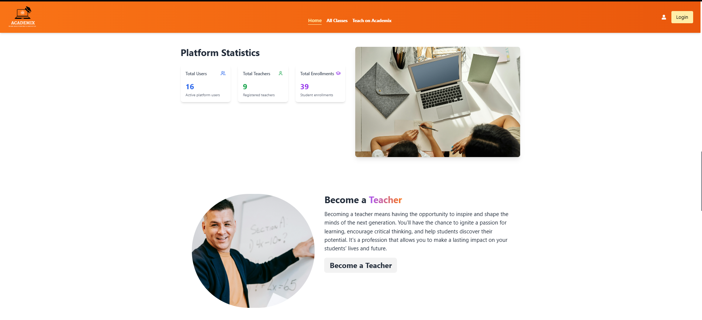
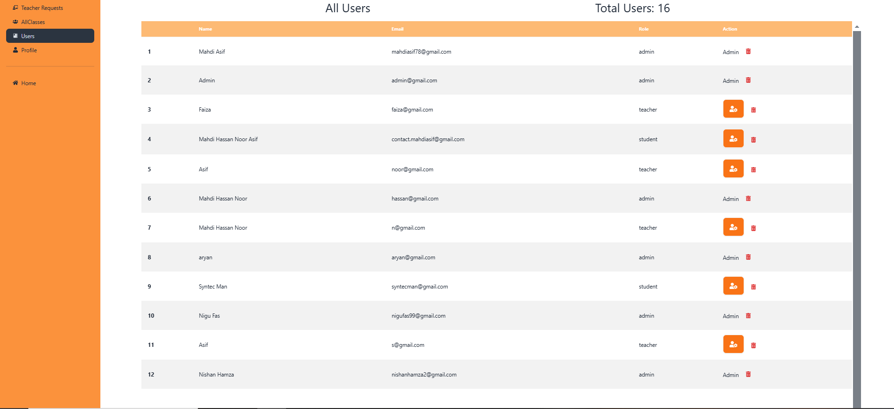
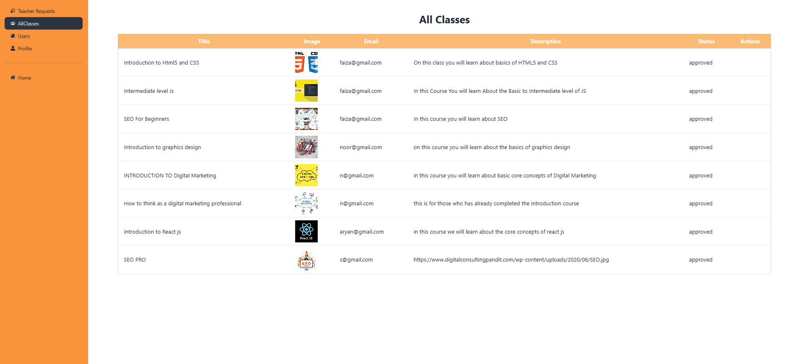
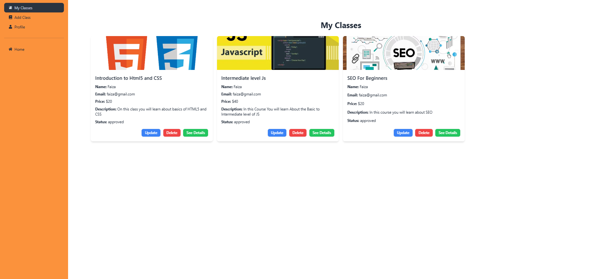
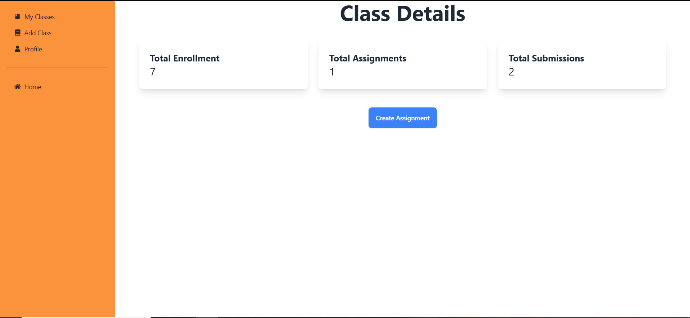

### Academix
A Comprehensive Education Management Platform
Visit the live site: https://academix-a7d0b.web.app/
Welcome to Academix, a powerful and intuitive platform designed to streamline education management for institutions, teachers, students, and administrators. Academix provides a centralized system for managing users, classes, enrollments, and more, making it easier to organize and track educational activities.

## Admin Access
Admin Username: admin@gmail.com

Admin Password: Admin018

## Features

* User Management

* Easily manage users (students, teachers, and administrators) with role-based access control.

* Add, update, or delete users from the platform.

* Class Management

* Create and organize classes with details such as class name, subject, and schedule.

* Assign teachers to specific classes for efficient course management.

* Enrollment System

* Streamline student enrollments into classes with a simple and intuitive interface.

* Track enrollment status and manage student participation.

* Dashboard Analytics

* Get real-time insights into platform statistics, including total users, teachers, classes, and enrollments.

* Visualize data with interactive charts and graphs.

* Role-Based Access Control

* Secure the platform with different access levels for admins, teachers, and students.

* Ensure that users only access features relevant to their roles.

* Responsive Design

* Enjoy a seamless experience across devices with a fully responsive and mobile-friendly design.

* Secure Authentication

* Protect user accounts with secure login and password management.

* Admins can reset passwords and manage user credentials.

* Teacher Profiles

* Maintain detailed profiles for teachers, including their qualifications, assigned classes, and contact information.

* Student Progress Tracking

* Monitor student performance and progress through enrolled classes.

* Generate reports for teachers and administrators.

* Scalable and Modular Architecture

* Built with scalability in mind, Academix can handle growing numbers of users and classes.

* Modular design allows for easy addition of new features in the future.

## Technologies Used
* Frontend: React.js, Tailwind CSS, Lucide Icons

* Backend: Node.js, Express.js

* Database: MongoDB

* Authentication: JWT (JSON Web Tokens)

* Deployment: Vercel and Firebase